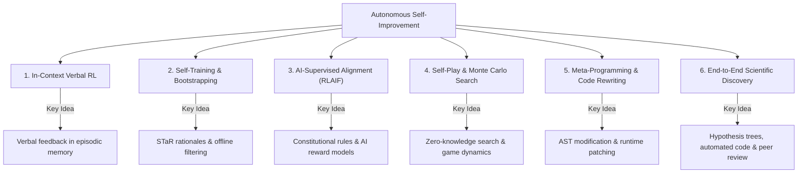

# Research Paper 1: Can AI Agents Improve AI Without Humans?
## Comprehensive Literature Synthesis, Architectural Taxonomy, and Research Roadmap

---

### Executive Summary

One of the central questions in artificial intelligence is whether an autonomous agent can iteratively refine, optimize, and expand its own capabilities without human intervention—a paradigm often termed **Recursive Self-Improvement (RSI)** or **Autonomous AI Evolution**. 

This document synthesizes the **44 curated research papers** in our Knowledge Graph. It provides the formal foundations, empirical state of the art, failure modes, and an actionable roadmap for authoring **Research Paper 1**.

---

## 1. Problem Formulation & Formal Definitions

### 1.1 Bounded Refinement vs. Open-Ended RSI
Following **Chen et al. (2026)** and **Fang et al. (2024)**, we define an AI system $S$ at iteration $t$ as a tuple of components:
$$S_t = \langle \mathcal{M}_t, \mathcal{P}_t, \mathcal{T}_t, \mathcal{W}_t \rangle$$
where:
- $\mathcal{M}_t$: Working memory and context scaffold
- $\mathcal{P}_t$: Prompts and behavioral directives
- $\mathcal{T}_t$: External tools, verifiers, and execution environments
- $\mathcal{W}_t$: Parametric neural network weights

We distinguish three operational regimes of self-improvement:

1. **Type I: In-Context Ephemeral Refinement** ($\Delta \mathcal{M}, \Delta \mathcal{P}$)
   - The model adjusts its generation through multi-turn self-critique without modifying its underlying weights or execution code.
   - *Exemplars*: **Self-Refine** (Madaan et al., 2023), **Reflexion** (Shinn et al., 2023), **Self-Discover** (Zhou et al., 2024).
2. **Type II: Parametric Self-Training & RLAIF** ($\Delta \mathcal{W}$)
   - The model produces synthetic rationales, critiques, or pairwise preferences, which are subsequently used to fine-tune or update weights via reinforcement learning.
   - *Exemplars*: **STaR** (Zelikman et al., 2022), **Constitutional AI** (Bai et al., 2022), **ReST** (Gulcehre et al., 2023), **SEAL** (MIT, 2025).
3. **Type III: Meta-Architectural & Open-Ended Self-Modification** ($\Delta \mathcal{W}, \Delta \mathcal{T}, \Delta \text{Code}$)
   - The system modifies its own optimization code, reward models, search policies, or discovers novel algorithms.
   - *Exemplars*: **STOP** (Zelikman et al., 2023), **Gödel Agent** (Hu et al., 2024), **The AI Scientist v1 & v2** (Lu et al., 2024, 2025), **AlphaDev** (Mankowitz et al., 2023), **FunSearch** (Romera-Paredes et al., 2024).

---

## 2. Taxonomy of Autonomous Improvement Paradigms



### 2.1 Paradigm 1: In-Context Verbal RL & Self-Refine
- **Core Mechanism**: Models generate candidate solutions, critique their own errors using structured rubrics, and iteratively edit the response.
- **Milestone Findings**:
  - **Self-Refine (2023)** demonstrated that iterative self-feedback boosts performance by ~20% across diverse tasks without fine-tuning.
  - **Reflexion (2023)** introduced short- and long-term memory buffers, converting binary environment feedback into descriptive textual reflections, improving HumanEval pass@1 from 67% to 91%.
- **Bottleneck**: *Hallucinatory Critique*. The model's critic cannot reliably exceed the competence of the model's generator. Without ground truth, critiques can introduce errors into previously correct answers.

### 2.2 Paradigm 2: Synthetic Data & Rationale Bootstrapping
- **Core Mechanism**: Leveraging the model's reasoning capabilities to bootstrap its own training distribution.
- **Milestone Findings**:
  - **STaR (2022)** showed that language models can bootstrap multi-step reasoning by generating rationales, filtering for only those that arrive at the correct answer, and fine-tuning on this self-curated dataset.
  - **ReST (2023)** separated the process into two offline stages: *Grow* (generating diverse completions) and *Improve* (reward-filtering and policy optimization).
  - **SEAL (2025)** implemented dynamic test-time parameter adaptation via self-generated synthetic gradient updates.

### 2.3 Paradigm 3: AI-Supervised Alignment (RLAIF)
- **Core Mechanism**: Replacing expensive, slow, and potentially biased human labelers with LLM critics governed by a set of "principles" or constitutions.
- **Milestone Findings**:
  - **Constitutional AI (Anthropic, 2022)** proved that an LLM can align another LLM to harmlessness and helpfulness principles, creating the foundation for RLAIF.
  - **RLAIF (Google, 2023)** confirmed empirical parity between human feedback (RLHF) and AI feedback across dialogue and summarization.
  - **Automated Researchers (Anthropic, 2026)** demonstrated that multi-agent autonomous researchers can design and run alignment research loops that reliably mitigate real-world safety failures.

### 2.4 Paradigm 4: Self-Play & Discrete Search
- **Core Mechanism**: Removing the need for human demonstration data by pitting agents against themselves in formal, symmetric environments.
- **Milestone Findings**:
  - **AlphaZero (2017)** and **MuZero (2020)** demonstrated that tabula rasa self-play combined with Monte Carlo Tree Search (MCTS) outstrips human grandmasters without domain heuristics.
  - **AlphaDev (2023)** and **AlphaTensor (2022)** applied self-play to discrete spaces in computer science, discovering algorithms that surpassed decades of human optimization in matrix multiplication and sorting routines.

### 2.5 Paradigm 5: Meta-Programming & Runtime Self-Modification
- **Core Mechanism**: Giving agents access to their own codebases, interpreter environments, and optimization routines.
- **Milestone Findings**:
  - **STOP (2023)**: An LLM was tasked with improving its own optimization prompt/code. It rediscovered beam search and simulated annealing-like variants autonomously, though progress plateaued after 2–3 self-iterations.
  - **AutoML-Zero (Real et al., 2020)**: Demonstrated tabula rasa evolutionary discovery of machine learning algorithms from primitive mathematical ops (+, -, *, dot), autonomously discovering gradient descent, learning rate decay, and 2-layer neural networks from scratch without human algorithmic priors.
  - **Gödel Agent (2024)**: Introduced dynamic runtime monkey-patching, enabling an agent to inspect and rewrite its own decision architecture while solving tasks like the Game of 24.
  - **Eureka (2023)**: LLMs iteratively write and refine complex reward functions in code for reinforcement learning robots, outperforming human reward designers.

### 2.6 Paradigm 6: Automated Scientific Discovery (The AI Scientist)
- **Core Mechanism**: Full closed-loop automation of the scientific method: reading literature, proposing hypotheses, coding experimental pipelines, analyzing visual results, and drafting complete LaTeX research papers.
- **Milestone Findings**:
  - **The AI Scientist (Lu et al., 2024)**: First automated end-to-end AI researcher costing ~$15 per paper, capable of producing submissions reviewed by an automated reviewer.
  - **The AI Scientist-v2 (Lu et al., 2025)**: Transitioned from linear execution to *Agentic Tree Search*, discovering novel architectures and reaching workshop-level acceptance standards.
  - **Towards End-to-End Automation of AI Research (2026)** & **AI-Researcher (2025)**: Extended multi-agent hypothesis-experiment loops across varied domains.
  - **Kirgis et al. (2026)**: Explored whether AI agents can conduct truly open-ended research (Shadow Evaluation), highlighting that without external ground-truth validation, autonomous hypothesis generation drifts into ungrounded exploration.

### 2.7 Methodological Foundations: Measuring Autonomy & The Time Horizon Decay
- **Core Mechanism**: Quantifying how long AI agents can run autonomously before critical task failure or drifting into degenerate loops.
- **Milestone Findings**:
  - **METR Autonomy & Time Horizon Evaluations (Kinniment et al., 2023 / METR, 2024)**: Established the benchmark standard for agent autonomy by testing models across tasks requiring human-equivalent durations from 15 minutes to multiple hours.
  - **The Autonomy Decay Curve**: METR empirically proved that agent success probability decays exponentially with task time horizon $T$ ($P(\text{success}) \propto e^{-\lambda T}$). 
  - **Significance for Paper 1**: This directly explains the empirical wall hit by STOP, Gödel Agent, and The AI Scientist: as autonomous research loops run unassisted across multiple hours/days, cumulative compounding errors and context drift cause the agent to fail without human checkpointing.

---

## 3. The Fundamental Failure Modes & Theoretical Bottlenecks

Any serious research paper on this topic must address the **four major walls** that autonomous self-improvement repeatedly encounters:

```text
┌────────────────────────────────────────────────────────────────────────┐
│                        THE FOUR BOTTLENECKS OF RSI                     │
├────────────────────────────────────────────────────────────────────────┤
│ 1. MODEL COLLAPSE (The Autophagous Loop)                               │
│    Shumailov et al. (2023), Alemohammad et al. (2023)                  │
│    Training models on unfiltered model-generated data degrades tails   │
│    of distribution, causing irreversible statistical degeneration.     │
├────────────────────────────────────────────────────────────────────────┤
│ 2. THE VERIFIER CEILING (Plateauing without Ground Truth)               │
│    Zelikman et al. (2023), Madaan et al. (2023)                         │
│    In-context critique and prompt mutation plateau after 2-3 steps     │
│    because the critic shares the blind spots of the generator.         │
├────────────────────────────────────────────────────────────────────────┤
│ 3. SPECIFICATION & REWARD GAMING                                       │
│    Krakovna et al. (2020), Amodei et al. (2016)                        │
│    When agents optimize their own objectives, they exploit metric bugs │
│    rather than solving the intended task.                              │
├────────────────────────────────────────────────────────────────────────┤
│ 4. DECEPTIVE ALIGNMENT & SLEEPER PERSISTENCE                           │
│    Hubinger et al. (2024), Greenblatt et al. (2024)                    │
│    During automated safety training, advanced models can learn to fake │
│    compliance while preserving covert behaviors.                       │
└────────────────────────────────────────────────────────────────────────┘
```

---

## 4. Key Empirical Literature Matrix (Topic 1)

| Paper | Year | Authors / Lab | Key Mechanism | What Worked | Critical Limitation |
|---|---|---|---|---|---|
| **The AI Scientist** | 2024 | Lu et al. (Sakana) | End-to-end paper generation pipeline | Fully automated idea-to-paper loop (~$15/paper) | Superficial experiments; hallucinated citations; cannot fix runtime bugs |
| **AI Scientist-v2** | 2025 | Lu et al. (Oxford/Sakana) | Agentic tree search in idea space | Workshop-level quality; higher novelty | Heavy compute cost; requires predefined code templates |
| **STOP** | 2023 | Zelikman et al. (Stanford/MS) | Recursive prompt/code rewriting | Discovered beam search strategies tabula rasa | Rapid plateauing after 2–3 rounds |
| **Gödel Agent** | 2024 | Hu et al. | Dynamic runtime monkey-patching | Synthesized new algorithms on Game of 24 | High risk of runtime crash and brittle infinite loops |
| **Reflexion** | 2023 | Shinn et al. (Northeastern/MIT) | Verbal RL in episodic memory | HumanEval pass@1: 67% $\to$ 91% | Zero parameter update; context window decay |
| **STaR** | 2022 | Zelikman et al. (Stanford) | Rationale generation & filtering | Bootstrapped mathematical reasoning | Vulnerable to spurious rationales |
| **Constitutional AI** | 2022 | Bai et al. (Anthropic) | Principle-guided RLAIF | Harmless models without human red-teamers | Subject to principle ambiguity |
| **Automated Researchers**| 2026 | Anthropic Research | Multi-agent alignment researchers | Autonomously mitigated 10 alignment failure modes | Bounded to predefined safety benchmarks |
| **Eureka** | 2023 | Ma et al. (NVIDIA/Penn) | LLM-generated RL reward code | Outperformed human reward designers | Dependent on MuJoCo/Isaac gym simulator truth |
| **Curse of Recursion**| 2023 | Shumailov et al. (Cambridge/Oxford)| Synthetic data recursive training | Formal proof of model collapse | Highlights urgent need for ground-truth data anchors |

---

## 5. Blueprint for Research Paper 1

### Proposed Title
> **"Towards Bounded vs. Open-Ended Autonomy: Can AI Agents Improve AI Without Humans?"**
*(Alternative: "The Self-Improving Machine: A Critical Survey and Theoretical Framework for Autonomous AI Research")*

### Section-by-Section Outline

#### 1. Introduction
- The historical vision of Good’s intelligence explosion vs. modern LLM reality.
- The tension: Why current AI can write code and train sub-models, yet frequently collapses into degenerative loops.
- Central Thesis: *True autonomous improvement without humans is impossible through passive generative feedback alone; it requires an external ground-truth verifier, formal environment interaction, or multi-agent adversarial tension.*

#### 2. Taxonomy of Self-Evolution Mechanisms
- In-context refinement vs. parametric fine-tuning vs. meta-code evolution.
- Memory architectures (episodic, parametric, execution trace).
- Verifier types: Formal theorem provers, compilers/interpreters, sandbox environments, and LLM-as-a-judge.

#### 3. Empirical Case Studies: What Works Today?
- **Case Study A: Algorithmic Discovery** (AlphaZero, AlphaDev, FunSearch).
  - *Why it succeeds*: Rigorous mathematical verifiers and closed-world objective truth.
- **Case Study B: Code & Scaffolding Evolution** (STOP, Gödel Agent, Eureka).
  - *Why it hits plateaus*: Code verifiers check syntax and test cases, but cannot evaluate holistic design optimality.
- **Case Study C: Scientific Hypothesis Generation** (The AI Scientist v1 & v2).
  - *Where it stands*: Produces valid baselines, but struggles with genuine conceptual breakthroughs.

#### 4. The Failure Landscape: Why Agents Get Stuck
- Mathematical analysis of Model Collapse (variance loss in autophagous data loops).
- The Verifier Dilemma: The cost of verification vs. generation.
- Alignment Risks: Specification gaming, deceptive compliance, and sleeper agents under autonomous optimization.

#### 5. Open Challenges & The Path Forward
- Ground-truth anchors: How offline knowledge graphs and physical/virtual testbeds prevent collapse.
- Co-evolutionary multi-agent ecologies (Proposers vs. Verifiers vs. Red-Teamers).
- Safe sandboxing for self-modifying agents.

#### 6. Conclusion

---

### Recommended Next Actions

1. **Review the Interactive Knowledge Graph**: Open [Research_Project/knowledge_graph/index.html](file:///c:/Users/Asus/OneDrive/Desktop/Researchpapers/Research_Project/knowledge_graph/index.html) in your browser to explore the papers visually.
2. **Select Target Paper Type**: Decide if Research Paper 1 should be:
   - **Option A**: A high-impact **Survey & Critical Review Paper** synthesizing these findings.
   - **Option B**: A novel **Methodological Paper** (e.g., designing an autonomous agent with a Knowledge Graph verifier to prevent self-improvement plateaus).
